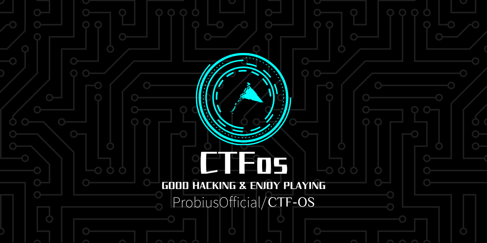
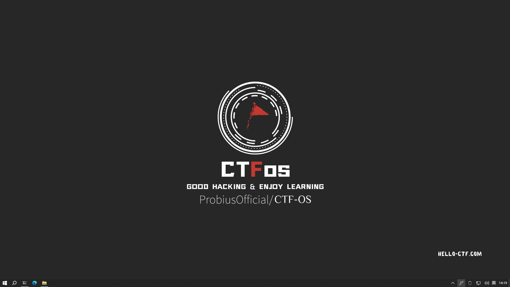
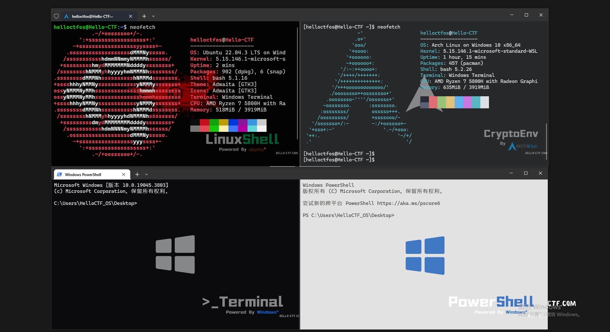
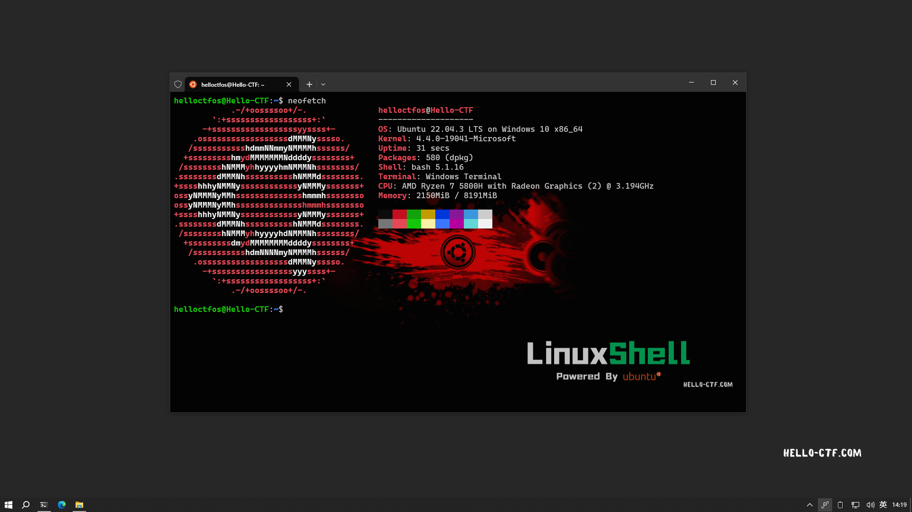
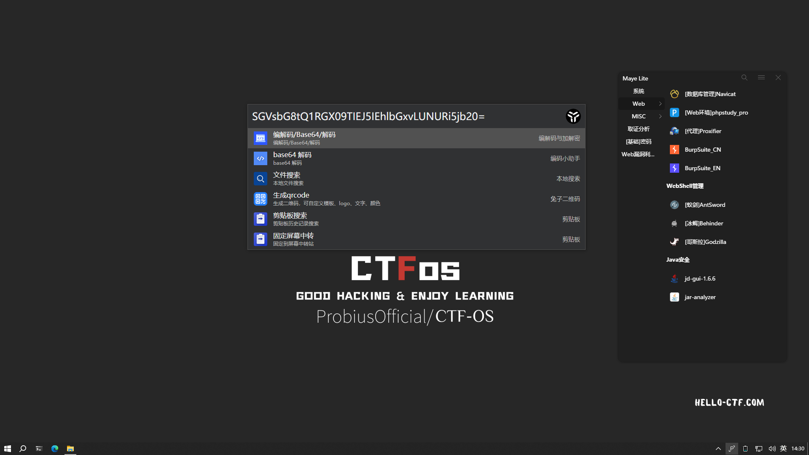
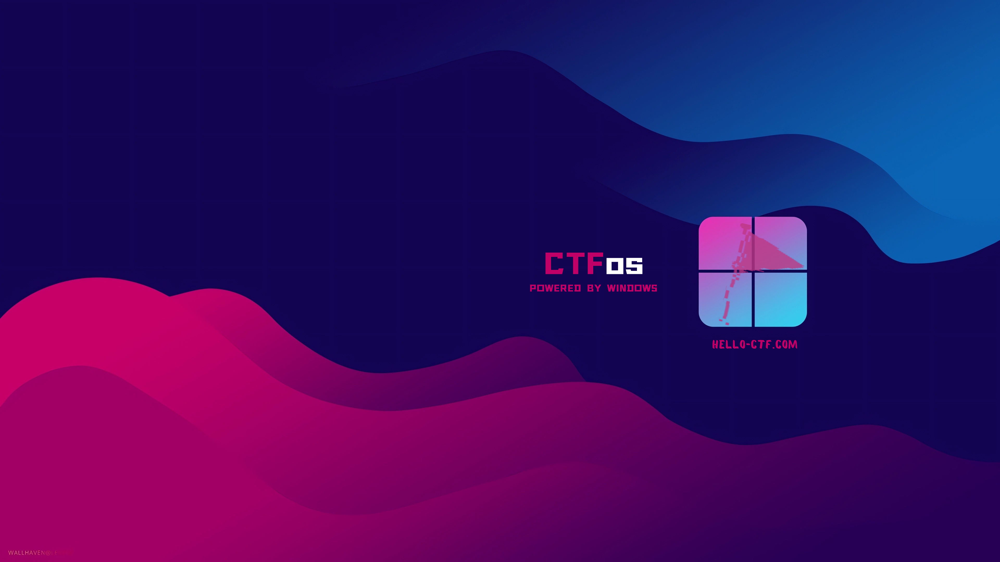
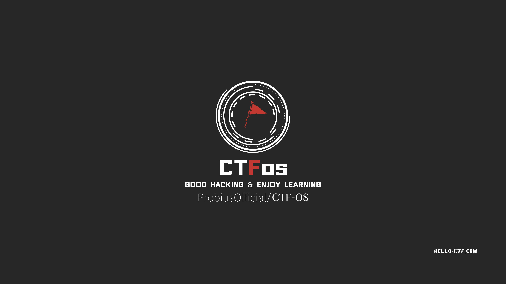
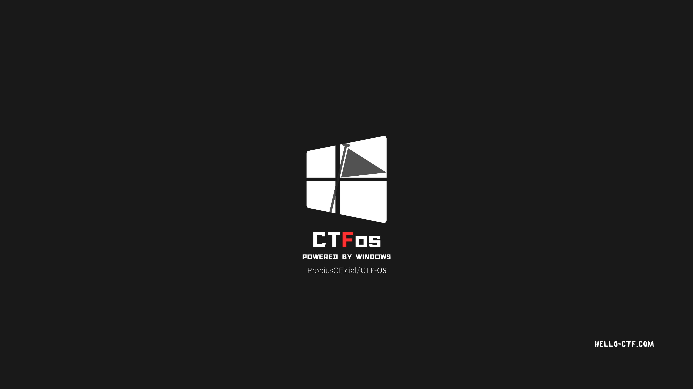

<div align="center">  
    
    <br> </br>
    <p> An Integrated OS For CTF(Capture The Flag)</p>
    <p>专为CTF比赛封装的虚拟机，基于工具集封装多个版本和系统，更多选择，开箱即用！</p>
</div> 

## DEMO









## Beta 版本(试运行)

- Python 3.8.2rc2 (tags/v3.8.2rc2:777ba07, Feb 18 2020, 09:11:15) [MSC v.1916 64 bit (AMD64)]

- Java 环境 jdk-1.8 (build 1.8.0_401-b10)

- PHPStudy v8.1.1.3

 - PHP 7.3.4

 - MySQL 5.7.26

 - Nginx 1.15.11

 - Apache 2.4.39

 - Msys2-x86_64-20240113 

 - gcc 13.2.0 @msys2

    WSL 子系统：

    ```
    WSL 版本： 2.0.9.0
    内核版本： 5.15.133.1-1
    WSLg 版本： 1.0.59
    MSRDC 版本： 1.2.4677
    Direct3D 版本： 1.611.1-81528511
    DXCore 版本： 10.0.25131.1002-220531-1700.rs-onecore-base2-hyp
    Windows 版本： 10.0.19045.3803
    ```


    子系统信息:

    ```
    Ubuntu 22.04.3 LTS on Windows 10 x86_64
    - Binwalk v2.3.4 https://github.com/ReFirmLabs/binwalk/releases/tag/v2.3.4
    - SQLMap v1.8.2 @pip
    - Foremost v1.5.7
    - dirsearch v0.4.3.post1 @pip
    - exiftool @apt
    - zsteg https://github.com/zed-0xff/zsteg @gem
    - StegoVeritas https://github.com/bannsec/stegoVeritas @pip
    ```

工具：
 - PixPin v1.7.5.0 源:https://pixpinapp.com/
 - BurpSuite v2024.1.1 源:https://www.52pojie.cn//thread-1544866-1-1.html
 - 010EditorWin64Portable14.0 源:https://www.52pojie.cn/thread-1863194-1-4.html
 - Wireshark-4.2.3-x64.exe 源:https://www.wireshark.org/download.html
 - Behinder_v4.1 源:https://github.com/rebeyond/Behinder/releases/tag/Behinder_v4.1%E3%80%90t00ls%E4%B8%93%E7%89%88%E3%80%91
 - Godzilla v4.0.1 源:https://github.com/BeichenDream/Godzilla/releases/tag/v4.0.1-godzilla
 - Ysoserial v0.0.6 源:https://github.com/frohoff/ysoserial/releases/tag/v0.0.6
 - ImHex v1.33.0 源:https://github.com/WerWolv/ImHex/releases/tag/v1.33.0
 - jar-analyzer v2.12 源:https://github.com/jar-analyzer/jar-analyzer/releases/tag/2.12
 - ciphey v5.14.0 @pip
 - Tweakpng v1.4.6 源:https://entropymine.com/jason/tweakpng/
 - stegdetect-0.4-for-Windows 源:Unknown
 - WaterMark 源:https://www.52pojie.cn/
 - CTFCrackTools v4.0.7 源:https://github.com/0Chencc/CTFCrackTools/releases/tag/4.0.7
 - PasswareKitForensic v2020 汉化 By Tokeii 源:忘记了x
 - Puzzle Solver v1.0.4 源:https://github.com/Byxs20/PuzzleSolver/releases 注：为尊重项目要求，只保留了最后一个开源版本，后续的版本请按照Release中的说明自行获取
 - BlueTeamTools 源:https://github.com/abc123info/BlueTeamTools/releases/tag/v0.92
 - z3-4.12.6 源:https://github.com/Z3Prover/z3/releases/tag/z3-4.12.6
 - LovelyMem 源:https://github.com/Tokeii0/LovelyMem/releases/tag/v0.2
 漏洞利用：
  - Struts2_19.21.jar 源:https://github.com/abc123info/Struts2VulsScanTools

  - ThinkphpGUI-1.3-SNAPSHOT.jar 源:https://github.com/Lotus6/ThinkphpGUI/releases/tag/1.3
  - 源:https://github.com/bewhale/thinkphp_gui_tools
  - ShiroExploit-Deprecated v2.51 源:https://github.com/feihong-cs/ShiroExploit-Deprecated/releases/tag/v2.51
  - ThinkPHP综合利用工具ShiroExploit v2.4.2 源:https://github.com/bewhale/thinkphp_gui_tools/releases/tag/v2.4.2

## Wallpaper








