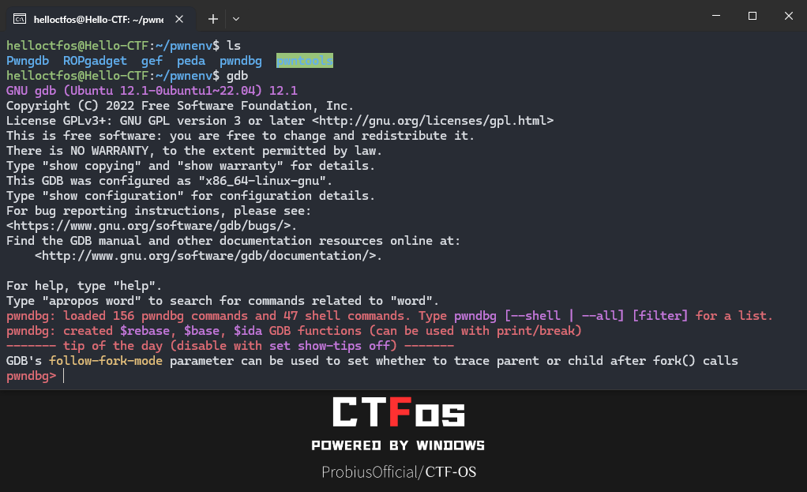
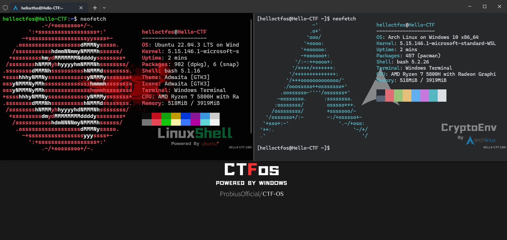

<div align="center">  
     
    <br> </br>
    <p> An Integrated OS For CTF(Capture The Flag)</p>
    <p>专为CTF比赛封装的虚拟机，基于工具集封装多个版本和系统，更多选择，开箱即用！</p>
</div> 

## 赞助我们？

<p float="left">
  
  
</p>

您的赞助将帮助我们完善项目ww

请在备注中注明，以便我们在项目中公开向您表示感谢.

## TODO

> [!TIP]
>
> - [ ] 为 Mac ARM 架构系列的虚拟机添加适配。  
> - [ ] Linux 版本的系统  
> - [ ] 自动化构建 (.sp1 / workflow 构建.iso)  
> - [ ] 更方便友好的更新方式（增量更新）  
> - [x] 更多的环境支持（二进制环境 / ...)  

## Why CTFos?

市面上其实有很多同类型的系统 —— 但这里的同类型指的是在安全和渗透相关的，而对于CTFs来讲，它们是臃肿的，而且都侧重在Web安全方面，并不友好。

当然，更多的情况是，在CTF比赛越来越普及的今天，它渗透到了各个行业里面，想象一下，上学打了几年CTF好不容易毕业了，跑到其他行业养老突然被领导拉着语重心长的说：“听说你上学的时候，比赛挺厉害的，正好最近我们有个行业赛，就是CTF，你上吧，顺便带带你的同事们” —— 

**本项目用于快速构建CTF的做题环境，避免CTF中各类软件环境对宿主机造成污染。**

**适用人群**：CTF入门选手，各行业从业人员，安全相关工作人员但不想在工作机上安装CTF一些奇奇怪怪的软件......

## About

Windows 版本为beta测试第二版，也是最接近正式版Windows版本的系统。

系统基于 WIndows 10 22H2 10.0.19045.3803 镜像制作，使用 软媒魔方 和 Dism++ 进行了部分优化和精简，内置 Ubuntu 22.04.3 on WSL2 / Arch Linux on WSL2 子系统。

其他系统依然在构建中，我们会尽快完成让他们与各位见面ww

## Statement

本系统中所出现的各类软件 / 工具 均来源于开源渠道，所有组件的来源均以注明 (详细见 **Detail** 部分)

由于时间和其他原因，系统并不能有效包含所有的CTF工具，不过我们会逐步更新和完善它，还请关注后续发版。

当然，如果您对系统后续更新有建议，请务必开 issues 告知我们。

本项目为 [Hello-CTF](https://github.com/ProbiusOfficial/Hello-CTF) 的子项目，大部分工具软件的选择基于 https://hello-ctf.com/ToolKit/ ,欢迎关注我们的公众号 Hello-CTF ，获取CTF相关资讯：


## DEMO




## Detail_Beta版本(试运行)

### 子系统信息

```
WSL 版本： 2.1.5.0
内核版本： 5.15.146.1-2
WSLg 版本： 1.0.60
MSRDC 版本： 1.2.5105
Direct3D 版本： 1.611.1-81528511
DXCore 版本： 10.0.25131.1002-220531-1700.rs-onecore-base2-hyp
Windows 版本： 10.0.19045.3803
```

> [!Warning]
>
> 由于WSL1于WSL2的区别，您在虚拟机使用WSL2中需要在VM的处理器设置中启用 `虚拟化的 Intel VT-x/EPT 或 AMD-V/RVI(V)`，该选项会与宿主机的Linux子系统相关服务(也就是HV相关服务)冲突，这会导致您可能无法在宿主机上正常使用WSL以及其他HV相关服务.
>
> 如果您想继续在宿主机中使用WSL，请对该系统的WSL2进行降级，并且完全关闭**虚拟机的HV服务**.



### Windows 信息

#### 系统环境

```
Python 3.8.2rc2 (tags/v3.8.2rc2:777ba07, Feb 18 2020, 09:11:15) [MSC v.1916 64 bit (AMD64)]
Java 环境 jdk-1.8 (build 1.8.0_401-b10)
PHP 7.3.4
MySQL 5.7.26
Nginx 1.15.11
Apache 2.4.39
Msys2-x86_64-20240113 
gcc 13.2.0 @msys2
```

#### 系统工具

| 工具名称        | 版本         | 源                                                           |
| --------------- | ------------ | ------------------------------------------------------------ |
| PHPStudy        | v8.1.1.3     | [xp.cn](https://www.xp.cn/)                                  |
| PixPin          | v1.7.5.0     | [pixpinapp.com](https://pixpinapp.com/)                      |
| Dism++          | v10.1.1002.2 | [GitHub](https://github.com/Chuyu-Team/Dism-Multi-language/releases/tag/v10.1.1002.2) |
| Everything      |              | [voidtools.com](https://www.voidtools.com/zh-cn/)            |
| 分区助手        |              | [disktool.cn](https://www.disktool.cn/)                      |
| PCmast-软媒魔方 |              | [ruanmei.com](https://mofang.ruanmei.com/)                   |

#### Web

| 工具名称      | 版本      | 源                                                           |
| ------------- | --------- | ------------------------------------------------------------ |
| Yakit         |           | [yaklang.com](https://yaklang.com/)                          |
| BurpSuite     | v2024.1.1 | [52pojie.cn](https://www.52pojie.cn//thread-1544866-1-1.html) |
| Behinder_v4.1 |           | [GitHub](https://github.com/rebeyond/Behinder/releases/tag/Behinder_v4.1【t00ls专版】) |
| Godzilla      | v4.0.1    | [GitHub](https://github.com/BeichenDream/Godzilla/releases/tag/v4.0.1-godzilla) |
| Ysoserial     | v0.0.6    | [GitHub](https://github.com/frohoff/ysoserial/releases/tag/v0.0.6) |
| jar-analyzer  | v2.12     | [GitHub](https://github.com/jar-analyzer/jar-analyzer/releases/tag/2.12) |

#### 文件Hex / 编辑

| 工具名称               | 版本    | 源                                                           |
| ---------------------- | ------- | ------------------------------------------------------------ |
| ImHex                  | v1.33.0 | [GitHub](https://github.com/WerWolv/ImHex/releases/tag/v1.33.0) |
| 010EditorWin64Portable | 14.0    | [52pojie.cn](https://www.52pojie.cn/thread-1863194-1-4.html) |

#### 隐写相关

| 工具名称                   | 版本   | 源                                                           |
| -------------------------- | ------ | ------------------------------------------------------------ |
| Tweakpng                   | v1.4.6 | [entropymine.com](https://entropymine.com/jason/tweakpng/)   |
| stegdetect-0.4-for-Windows |        | Unknown                                                      |
| WaterMark                  |        | [52pojie.cn](https://www.52pojie.cn/)                        |
| z3                         | 4.12.6 | [GitHub](https://github.com/Z3Prover/z3/releases/tag/z3-4.12.6) |

#### MISC 综合工具

| 工具名称                                                     | 版本   | 源                                                           |
| ------------------------------------------------------------ | ------ | ------------------------------------------------------------ |
| 随波逐流CTF编码工具 / 随波逐流 OCR识别工具 / 随波逐流224种编码图 |        | [1o1o.xyz](http://1o1o.xyz/index.html)                       |
| CTFCrackTools                                                | v4.0.7 | [GitHub](https://github.com/0Chencc/CTFCrackTools/releases/tag/4.0.7) |
| Puzzle Solver                                                | v1.0.4 | [GitHub](https://github.com/Byxs20/PuzzleSolver/releases)    |

#### 取证分析

| 工具名称            | 版本                 | 源                                                           |
| ------------------- | -------------------- | ------------------------------------------------------------ |
| Wireshark           | 4.2.3-x64.exe        | [wireshark.org](https://www.wireshark.org/download.html)     |
| LovelyMem           |                      | [GitHub](https://github.com/Tokeii0/LovelyMem/releases/tag/v0.2) |
| BlueTeamTools       | v0.92                | [GitHub](https://github.com/abc123info/BlueTeamTools/releases/tag/v0.92) |
| PasswareKitForensic | v2020 汉化 By Tokeii | NULL                                                         |
| autopsy             | v4.21.0              | [GitHub](https://github.com/sleuthkit/autopsy/releases/tag/autopsy-4.21.0) |
| Volatility3         | v3-2.5.2             | [GitHub](https://github.com/volatilityfoundation/volatility3) |
| Volatility2         | v2.6                 | [GitHub](https://github.com/volatilityfoundation/volatility) |
| WinHex              | v20.5                | [x-ways.net](https://www.x-ways.net/winhex/index-m.html)     |
| X-Ways_Forensics    | v20.5                | [x-ways.net](https://www.x-ways.net/winhex/index-m.html)     |

#### 密码学

| 工具名称                                                   | 版本                                   | 源                                                   |
| ---------------------------------------------------------- | -------------------------------------- | ---------------------------------------------------- |
| CTF_AES加解密工具 / 国密SM4加解密工具 / 轩禹CTF_RSA工具3.6 |                                        | [bilibili.com](https://space.bilibili.com/317479700) |
| ciphey                                                     | v5.14.0                                | @pip                                                 |
| Z3求解器                                                   |                                        |                                                      |
| SageMath(On WSL Arch)                                      | version 10.3, Release Date: 2024-03-19 | [sagemath.org](https://www.sagemath.org/)            |

#### 二进制

| 工具名称               | 版本                         | 源                                                           |
| ---------------------- | ---------------------------- | ------------------------------------------------------------ |
| IDA Pro                | v8.3                         | [52pojie.cn](https://down.52pojie.cn/Tools/Disassemblers/)   |
| x64dbg                 |                              | [x64dbg.com](https://x64dbg.com/)                            |
| exeinfope              | v0.0.8.3                     | [GitHub](https://github.com/ExeinfoASL/ASL/releases)         |
| dnspy                  | v6.1.8                       | [GitHub](https://github.com/dnSpy/dnSpy/releases/tag/v6.1.8) |
| dnSpyEX/dnSpy          | v6.5.0                       | [GitHub](https://github.com/dnSpyEx/dnSpy/releases/tag/v6.5.0) |
| Ghidra                 | v11.0.2                      | [GitHub](https://github.com/NationalSecurityAgency/ghidra/releases/tag/Ghidra_11.0.2_build) |
| Resource Hacker        | v5.2.7                       | [angusj.com](https://www.angusj.com/resourcehacker/)         |
| 吾爱破解专用版Ollydbg  |                              | [52pojie.cn](https://down.52pojie.cn/Tools/Debuggers/)       |
| Windbg                 | v10.0.22621.2428             | [52pojie.cn](https://down.52pojie.cn/Tools/Debuggers/)       |
| Cheat Engine           | v7.5                         | [cheatengine.org](https://www.cheatengine.org/)              |
| LuaDec (On WSL Ubuntu) | 2.2 rev: 895d923 for Lua 5.1 | [GitHub](https://github.com/viruscamp/luadec)                |
| angrop (Python)        |                              | pip                                                          |

#### PWN

该部分环境安装于 WSL Ubuntu 22.04.3 LTS. `/home/helloctfos/pwnenv/`

| 工具名称      | 工具信息                                            | 安装方式(源)                                                 |
| ------------- | --------------------------------------------------- | ------------------------------------------------------------ |
| vim文本编辑器 | 文本编辑器                                          | `sudo apt install vim`                                       |
| git           | 开源的分布式版本控制系统                            | `sudo apt install git`                                       |
| gcc           | GNU编译器套件                                       | `sudo apt install gcc`                                       |
| python3-pip   | Python 包管理工具                                   | `sudo apt install python3-pip`                               |
| qemu          | 处理器模拟器                                        | `sudo apt-get install qemu-user qemu-system`                 |
| gdb-multiarch | gdb客户端进行调试的通用客户端                       | `sudo apt-get install gdb-multiarch`                         |
| Pwntools      | CTF框架和开发库                                     | `git clone https://github.com/Gallopsled/pwntools.git` and other install commands |
| gdb插件       | 包括peda、pwndbg、gef、Pwngdb                       | Cloning from respective repositories and setup               |
| ROPgadget     | 在二进制文件中搜索小工具                            | `sudo pip3 install capstone` and `git clone https://github.com/JonathanSalwan/ROPgadget.git` |
| one_gadget    | 查找ELF文件中的execve(’/bin/sh’, NULL, NULL)        | `sudo apt install ruby` and `sudo gem install one_gadget`    |
| seccomp-tools | 分析CTF pwn挑战中的seccomp沙盒                      | `sudo gem install seccomp-tools`                             |
| LibcSearcher  | 在泄露了Libc中的某一个函数地址后辅助工具            | `git clone https://github.com/lieanu/LibcSearcher.git`       |
| patchelf      | 修改现有ELF可执行文件和库的工具                     | `sudo apt install patchelf`                                  |
| ARM PWN       | ARM软件包，具备ARM交叉编译gcc与ARM程序动态链接库    | `sudo apt-get install gcc-arm-linux-gnueabi` and other ARM packages |
| MIPS PWN      | MIPS软件包，具备MIPS交叉编译gcc与MIPS程序动态链接库 | `sudo apt-get install gcc-mips-linux-gnu` and other MIPS packages |


#### 安卓

| 工具名称                   | 版本             | 源                                                           |
| -------------------------- | ---------------- | ------------------------------------------------------------ |
| ADB                        | v35.0.1-11580240 | [google](https://dl.google.com/android/repository/platform-tools-latest-windows.zip) |
| GDA-android-reversing-Tool | v4.10            | [GitHub](https://github.com/charles2gan/GDA-android-reversing-Tool/releases/tag/GDA4.10) |
| jadx-gui                   | v1.4.7           | [GitHub](https://github.com/skylot/jadx/releases/tag/v1.4.7) |

#### 漏洞利用

| 工具名称                         | 版本   | 源                                                           |
| -------------------------------- | ------ | ------------------------------------------------------------ |
| Struts2_19.21.jar                |        | [GitHub](https://github.com/abc123info/Struts2VulsScanTools) |
| ThinkphpGUI                      | 1.3    | [GitHub](https://github.com/Lotus6/ThinkphpGUI/releases/tag/1.3) |
| thinkphp_gui_tools               |        | [GitHub](https://github.com/bewhale/thinkphp_gui_tools)      |
| ShiroExploit-Deprecated          | v2.51  | [GitHub](https://github.com/feihong-cs/ShiroExploit-Deprecated/releases/tag/v2.51) |
| ThinkPHP综合利用工具ShiroExploit | v2.4.2           | [GitHub](https://github.com/bewhale/thinkphp_gui_tools/releases/tag/v2.4.2) |

## Wallpaper


## End.


